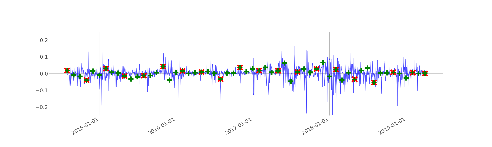
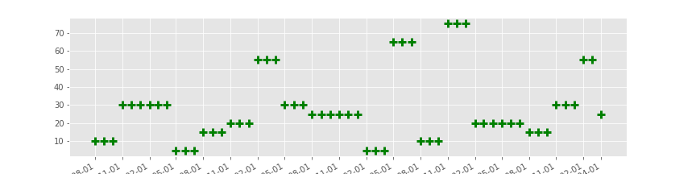
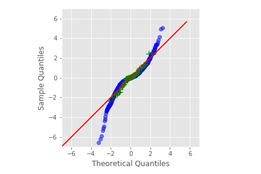
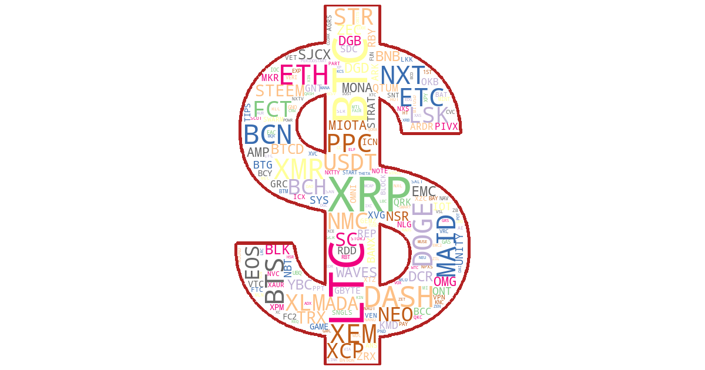

[](http://quantlet.de/)

## [](http://quantlet.de/) **CRIX_Rebalancing_Analysis** [](http://quantlet.de/)

```yaml

Name of Quantlet: CRIX_Rebalancing_Analysis
 
Published in: Statistical Learning Class (AAU Klagenfurt 2019)
  
Description: 'An Analysis of CRX daily log returns - are there higher returns at lower risk on index rebalancing days.'
 
Keywords: CRIX, non-parametric tests, daily logreturns, normality, t-test

See also: https://www.icloud.com/keynote/0YRKCRJ3rY6lZdrj_scHZCD0A#20190528_An_Analysis_of_CRIX_daily_returns        

Author: Patrick Plum
  
Submitted:  28.5.2019       
  
Datafile:  crypto_daily.csv, index_members.csv, crix1.json
  
Input: Dollar.png
  
Output: Wordcloud_CRIX_Frequency.png, Nr_of_Cryptos.png, DailyLogReturns.png, QQPlot_first.png, QQplot_others.png
  
Example:  
```








