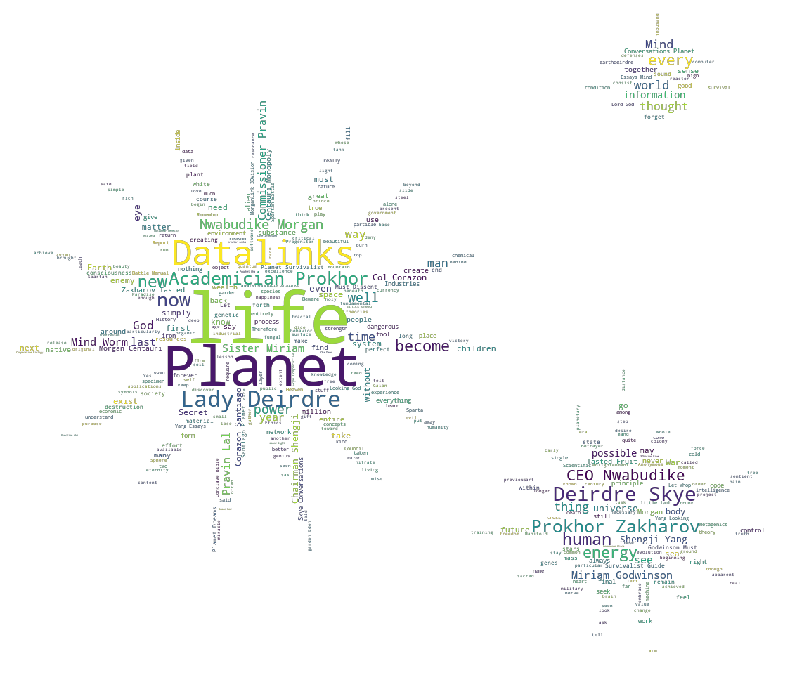
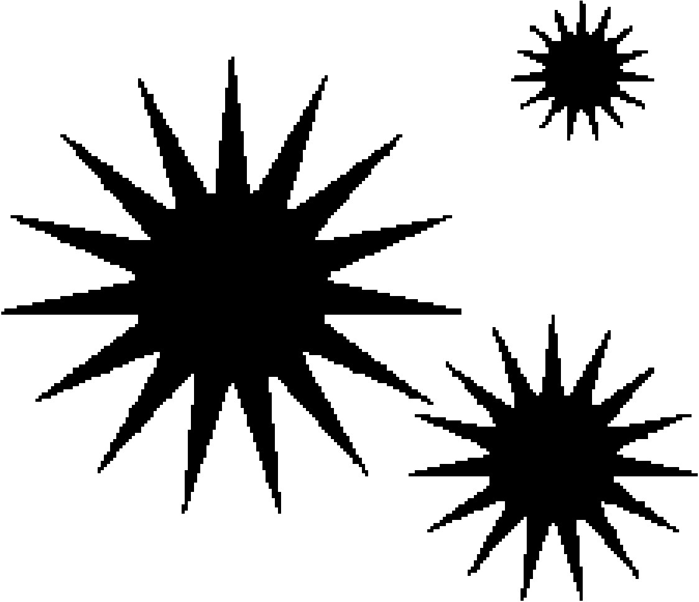
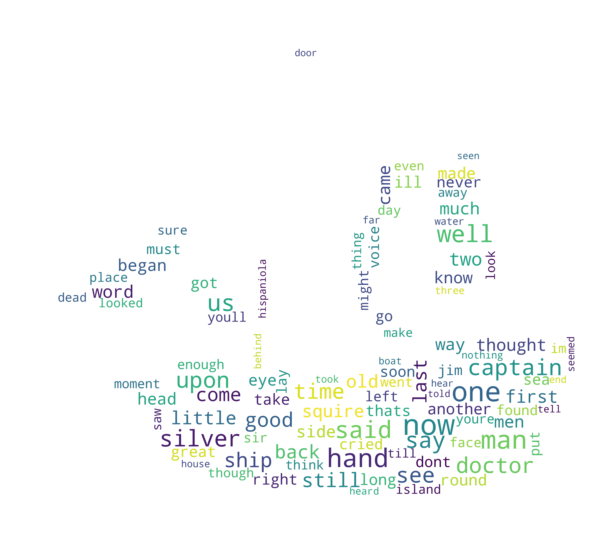

[](http://quantlet.de/)

## [](http://quantlet.de/) **SL_2019_alpha_centauri_pirates_wordcloud** [](http://quantlet.de/)

```yaml

Name of Quantlet: 	SL_2019_alpha_centauri_pirates_wordcloud

Published in:      	Statistical Learning Class (AAU Klagenfurt 2019)

Description:		Creates a word cloud picture of frequently used words in Robert L. Stevenson's Treasure 				Island. Based on another piece of python code by verani. Then creates another word clud 			picture of frequently used words in the blurbs of the 1999 video game 'Alpha Centauri'.
	
Keywords:		LDA, word cloud, topic modelling, pirates, word frequency, treasure island, Alpha 					Centauri, Stars

See also: 		LDA-DTM_Christmas_Songs

Author:			Miriam Köberl, Philipp Schneider
```








### PYTHON Code
```python

# -*- coding: utf-8 -*-
"""
Created on Wed Apr  3 10:53:03 2019

@author: Philipp Schneider, Miriam Köberl
"""

# treasure island wordcloud, based on the christmas song wordcloud by verani.

#!/usr/bin/env python3
# -*- coding: utf-8 -*-
"""
Created on Sun May  6 19:10:18 2018

@author: verani
"""
#Please install these modules before you run the code 
#!pip install wordcloud
#!pip install nltk
#!pip install Pillow
#!pip install numpy

#!pip install gensim
#!pip install pandas

############################################################# 
# Part I: Pirates wordcloud 
############################################################# 


import matplotlib.pyplot as plt
import re
import os
from os import path
from PIL import Image
from wordcloud import WordCloud, STOPWORDS
import numpy as np

# Please make sure that all the required files are in your working directory
# or change the working directory to your path!

d = os.getcwd()

raw_text= open(path.join(d, 'schatzinselutf8.txt'), encoding = "utf8").read()
raw_text= raw_text.replace("\n"," ")

cleantextprep = str(raw_text)


# keep only letters, numbers and whitespace
expression = "[^a-zA-Z0-9 ]" 
cleantextCAP = re.sub(expression, '', cleantextprep) # apply regex
cleantext = cleantextCAP.lower() # lower case 


text_file = open("Output_total.txt", "w")


text_file.write(str(cleantext))
text_file.close()


root_path = os.getcwd()

# Read the whole text.
with open(path.join(root_path, 'Output_total.txt'), 'r', encoding='utf-8', errors='ignore') as outout_file:
    text = outout_file.readlines()

# Mask
xmas_tree_pic = np.array(Image.open(path.join(root_path, "pirate-ship.jpg")))


# Optional additional stopwords
stopwords = set(STOPWORDS)


# Construct Word Cloud
# no backgroundcolor and mode = 'RGBA' create transparency
wc = WordCloud(max_words=100, mask=xmas_tree_pic,
               stopwords=stopwords, mode='RGBA', background_color=None)


# Pass Text
wc.generate(text[0])

# store to file
wc.to_file(path.join(root_path, "wordcloud_treasure_island.png"))

plt.imshow(wc, interpolation='bilinear')
plt.axis("off")
plt.show()


############################################################# 
# Part II: Alpha Centauri wordcloud 
############################################################# 
#
# Please change the working directory to your path!
root_path = os.getcwd()

# Read the whole text.
with open(path.join(root_path, 'BlurbsEdit.txt'), 'r', encoding='utf-8', errors='ignore') as outout_file:
    text = outout_file.readlines()


# Mask
suns_pic = np.array(Image.open(path.join(root_path, "peace3.jpg")))

stopwords = set(STOPWORDS)
stopwords.add("will")
stopwords.add("us")
stopwords.add("one")

# Construct Word Cloud
# no backgroundcolor and mode = 'RGBA' create transparency
wc = WordCloud(max_words=1000, mask=suns_pic,
               stopwords=stopwords, mode='RGBA', background_color=None)

# Pass Text
wc.generate(text[0])

# store to file
wc.to_file(path.join(root_path, "alphacentauriwords.png"))

# to show the picture 
plt.imshow(wc, interpolation='bilinear')
plt.axis("off")# 
plt.show()

```

automatically created on 2019-06-13